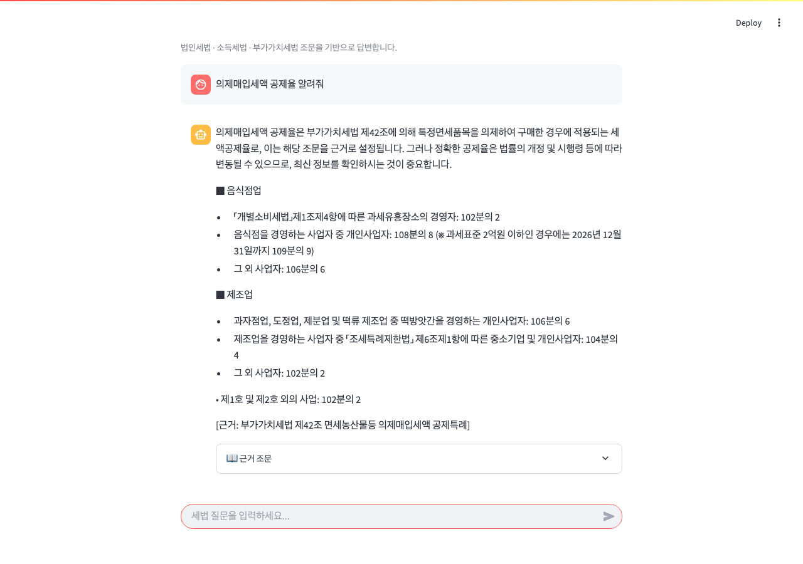

# 세법 챗봇 (Tax Law Chatbot)

법제처 Open API로 최신 세법 조문을 자동으로 가져와 로컬 LLM(Ollama)으로 답변하는 무료 세법 챗봇입니다.  
**API 비용 없이** 로컬에서 완전히 동작하며, 답변 시 근거 조문을 함께 표시합니다.

---

## 데모



---

## 작동 원리

```
사용자 질문
    ↓
BM25 키워드 검색 (kiwipiepy 한국어 형태소 분석)
    ↓
관련 세법 조문 추출
    ↓
율표(공제율 표)가 있으면 → 직접 파싱하여 카테고리별 정리
없으면 → Ollama 로컬 LLM(qwen2:7b)으로 요약
    ↓
근거 조문이 명시된 답변
```

**할루시네이션 방지**: LLM이 자체 지식으로 답변하지 않고, 실제 조문 원문을 검색한 뒤 그 내용만을 근거로 답변합니다.

---

## 기술 스택

| 역할 | 기술 |
|---|---|
| UI | Streamlit |
| LLM | Ollama (qwen2.5:7b) — 로컬, 무료 |
| 검색 | BM25 (rank_bm25) + kiwipiepy 형태소 분석 |
| RAG 프레임워크 | LangChain |
| 세법 데이터 | 법제처 Open API |

> ChromaDB / OpenAI / Claude API 불필요 — 완전 무료 로컬 실행

---

## 수록 법령 (자동 갱신)

- 법인세법 (255개 조문)
- 소득세법 (393개 조문)
- 부가가치세법 (106개 조문)
- 조세특례제한법 (493개 조문)

---

## 프로젝트 구조

```
tax-chatbot/
│
├── app.py              # Streamlit 앱 실행 진입점
├── config.py           # 모델명, 경로, 파라미터 설정값
├── .env                # API 키 (git 제외)
├── .env.example        # API 키 템플릿 (git 포함)
├── requirements.txt    # 패키지 목록
│
├── data/
│   └── laws/           # 법제처 API로 받아온 조문 JSON 저장
│
└── src/
    ├── fetcher.py      # 법제처 API → 조문 다운로드 → data/laws/ 저장
    ├── loader.py       # data/laws/ 파일 읽기 → Document 변환
    ├── indexer.py      # ChromaDB 인덱싱 (현재 BM25로 대체됨)
    └── chatbot.py      # 질문 → BM25 검색 → 율표 파싱 또는 LLM → 답변
```

---

## 설치 및 실행

### 1. Ollama 설치

[ollama.com](https://ollama.com) 에서 설치 후:

```bash
ollama pull qwen2.5:7b
```

### 2. 패키지 설치

```bash
python3 -m venv venv
source venv/bin/activate   # Windows: venv\Scripts\activate
pip install -r requirements.txt
pip install rank_bm25 kiwipiepy
```

### 3. 법제처 API 키 설정

[law.go.kr](https://www.law.go.kr) 회원가입 후 Open API 신청.  
`.env` 파일에 아이디(OC 값) 입력:

```
MOLEG_API_KEY=your_id_here
```

### 4. 세법 조문 다운로드

```bash
python -m src.fetcher
```

법인세법, 소득세법, 부가가치세법, 조세특례제한법을 `data/laws/`에 저장합니다.  
개정이 있을 때 다시 실행하면 최신 조문으로 자동 갱신됩니다.

### 5. 앱 실행

```bash
streamlit run app.py
```

---

## 주요 기능

- **율표 직접 파싱**: 가목/나목 같은 법률 약어 없이 카테고리별로 공제율 표시
- **관련성 점수 필터**: 관련 조문이 없으면 "데이터에 없습니다"로 안내
- **근거 조문 명시**: 모든 답변에 법령명과 조번호 표시
- **완전 무료**: 유료 API 불필요, 로컬 LLM만 사용

---

## 한계점

### 1. 로컬 소형 모델의 답변 누락

조문 원문에 내용이 존재하더라도, 로컬 7B 모델이 답변 생성 시 세부 조건을 스스로 생략하는 경우가 있습니다. 이는 법제처 데이터의 문제가 아니라 소형 LLM이 긴 조문에서 모든 세부 조건을 빠짐없이 추출하는 데 한계가 있기 때문입니다. Claude API 등 대형 모델을 연동하면 크게 개선됩니다.

### 2. 검색 커버리지

자주 묻는 핵심 개념은 CONCEPT_MAP으로 직접 매핑하여 정확하게 조문을 찾습니다. 그 외의 질문은 BM25 키워드 검색으로 처리하는데, 질문의 표현과 조문 제목의 키워드가 다를 경우 관련 조문을 찾지 못할 수 있습니다.

### 3. 수록 법령 외 질문

현재 법인세법, 소득세법, 부가가치세법, 조세특례제한법 및 각 시행령만 수록되어 있습니다. 상속세 및 증여세법, 지방세법 등은 포함되어 있지 않습니다.

---

## 주의사항

- `.env` 파일에는 API 키가 포함되어 있으므로 절대 GitHub에 올리지 않습니다.
- Ollama가 실행 중이어야 챗봇이 동작합니다 (`ollama serve`)
- 법제처 Open API는 무료이며, 회원가입 후 로그인 아이디를 `MOLEG_API_KEY`로 사용합니다.

---

## 개발 로드맵

- [x] 프로젝트 설계 및 환경 구성
- [x] 법제처 Open API 연동 (조문 자동 갱신)
- [x] Ollama 로컬 LLM 연동 (무료화)
- [x] BM25 + 한국어 형태소 분석 검색 구현
- [x] 율표 직접 파싱 (가목/나목 제거)
- [x] 조세특례제한법 추가
- [x] 관련성 점수 필터링
- [ ] 상속세 및 증여세법 추가
- [ ] 모바일 UI 개선
